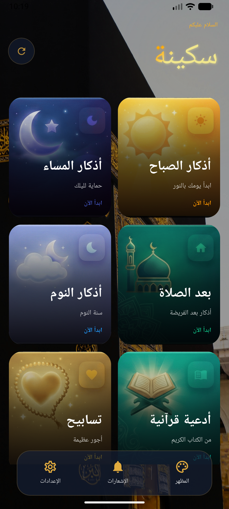
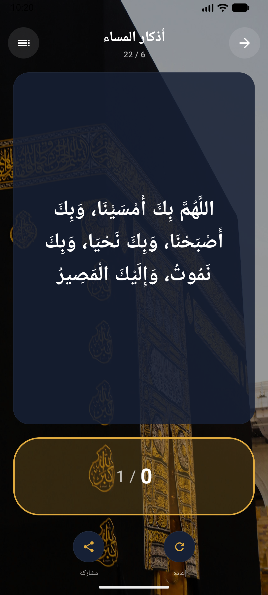
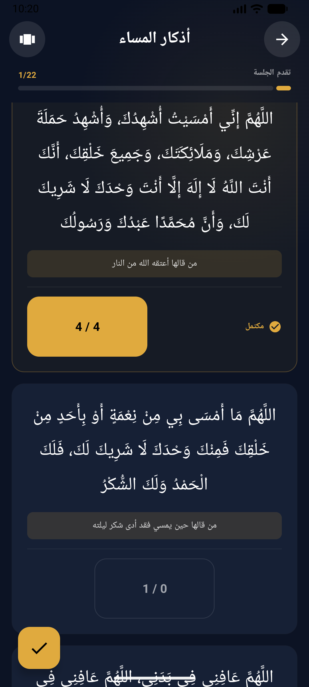
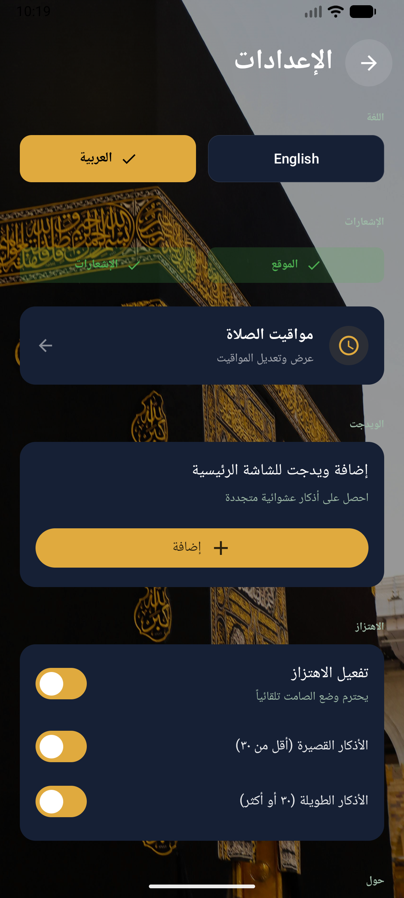
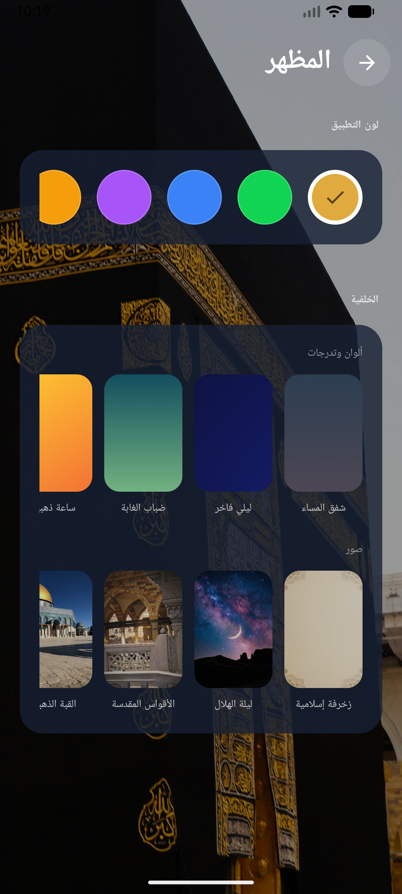
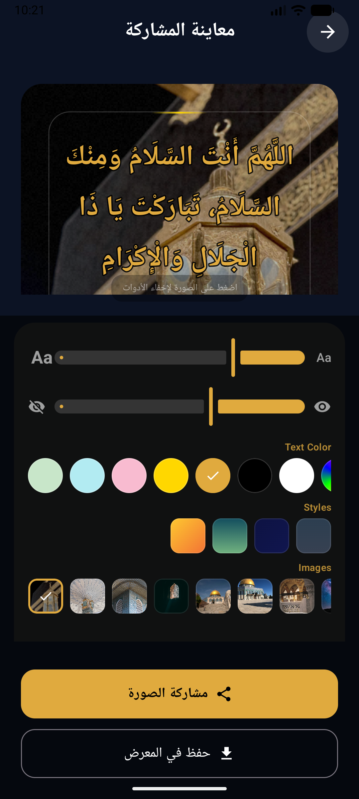

# سكينة | Sakina

**رفيقك الروحاني اليومي | Your Daily Spiritual Companion** 🤲

[📥 تحميل التطبيق | Download APK](https://github.com/RioG20/Sakina/releases/download/V1.0/Sakina-V1.0.apk)

---

## 📖 نبذة عن التطبيق

**سكينة** هو تطبيق إسلامي مصمم بعناية ليكون رفيقك اليومي في ذكر الله. يجمع بين جمال التصميم وسهولة الاستخدام ليقدم تجربة روحانية فريدة تساعدك على المواظبة على أذكارك وأدعيتك.

> **﴿ أَلَا بِذِكْرِ اللَّهِ تَطْمَئِنُّ الْقُلُوبُ ﴾** — سورة الرعد، ٢٨

## 📖 About

**Sakina** is a beautifully crafted Islamic app designed to be your daily companion in remembering Allah. It combines elegant design with ease of use, offering a unique spiritual experience to help you stay consistent with your daily Adhkar and Duas.

> **"Verily, in the remembrance of Allah do hearts find rest."** — Ar-Ra'd, 28

---

## ✨ المميزات | Features

- 📿 **أذكار شاملة** — الصباح، المساء، النوم، بعد الصلاة، أدعية قرآنية، وتسابيح
- 🕐 **مواقيت الصلاة** — حساب تلقائي حسب موقعك مع إمكانية التعديل
- 📊 **تتبع التقدم** — عداد تكرار وشريط تقدم لكل جلسة
- 🎨 **تخصيص المظهر** — ألوان وخلفيات متعددة مع ثيمات ديناميكية
- 📤 **مشاركة الأذكار** — شارك الأذكار كصور جميلة قابلة للتخصيص
- 🔔 **تذكيرات ذكية** — إشعارات مخصصة مع دعم الاهتزاز
- 📱 **ويدجت** — ذكر عشوائي متجدد على الشاشة الرئيسية
- 🌐 **ثنائي اللغة** — عربي وإنجليزي

- 📿 **Comprehensive Adhkar** — Morning, Evening, Sleep, After Prayer, Quranic Duas & Tasbeeh
- 🕐 **Prayer Times** — Auto-calculated based on your location with manual adjustment
- 📊 **Progress Tracking** — Repetition counter and progress bar for each session
- 🎨 **Theme Customization** — Multiple colors, backgrounds & dynamic themes
- 📤 **Share Adhkar** — Share as beautiful customizable images
- 🔔 **Smart Reminders** — Custom notifications with haptic feedback
- 📱 **Home Widget** — Random refreshing Dhikr on your home screen
- 🌐 **Bilingual** — Arabic & English

---

## 📱 لقطات من التطبيق | Screenshots

<table>
<tr>
<td align="center"><strong>الرئيسية | Home</strong></td>
<td align="center"><strong>الأذكار | Dhikr</strong></td>
<td align="center"><strong>القائمة | List</strong></td>
</tr>
<tr>
<td></td>
<td></td>
<td></td>
</tr>
<tr>
<td align="center"><strong>الإعدادات | Settings</strong></td>
<td align="center"><strong>المظهر | Themes</strong></td>
<td align="center"><strong>المشاركة | Share</strong></td>
</tr>
<tr>
<td></td>
<td></td>
<td></td>
</tr>
</table>

<table>
<tr>
<td align="center"><strong>معاينة الصورة | Image Preview</strong></td>
</tr>
<tr>
<td></td>
</tr>
</table>

---

## 📲 التثبيت | Installation

1. حمّل ملف الـ APK من [صفحة الإصدارات](https://github.com/RioG20/Sakina/releases/tag/V1.0)
2. فعّل «التثبيت من مصادر غير معروفة» في إعدادات جهازك
3. افتح الملف وثبّته
4. استمتع بتجربة سكينة 🤲

1. Download the APK from the [Releases page](https://github.com/RioG20/Sakina/releases/tag/V1.0)
2. Enable "Install from unknown sources" in your device settings
3. Open the file and install
4. Enjoy Sakina 🤲

---

## 📋 المتطلبات | Requirements

| | |
|:---|:---|
| **Android** | 8.0+ (API 26) |
| **Size** | ~14 MB |

---

## 🔐 الخصوصية | Privacy

- يعمل بالكامل بدون إنترنت
- لا يجمع أي بيانات شخصية — كل شيء يُخزن محلياً
- الموقع اختياري ويُستخدم فقط لحساب مواقيت الصلاة

- Works entirely offline
- No personal data collected — everything is stored locally
- Location is optional, used only for prayer time calculation

---

## 💬 التواصل | Contact

لأي اقتراحات أو ملاحظات:

For suggestions or feedback:

- 🐛 [Issues](https://github.com/RioG20/Sakina/issues)

---

## 📜 الرخصة | License

جميع الحقوق محفوظة © ٢٠٢٦ نور البنا. يُسمح بتحميل التطبيق واستخدامه شخصياً فقط. لمزيد من التفاصيل، راجع ملف [LICENSE](LICENSE).

All rights reserved © 2026 Nour Albanna. You may download and use the app for personal use only. See [LICENSE](LICENSE) for details.

---

**صُنع بـ ❤️ لخدمة المسلمين**

**Made with ❤️ to serve the Muslim community**

⭐ Star this repo if you find it helpful ⭐

